# WAPH - Web Application Programming and Hacking

## Instructor

**Dr. Phu Phung**

## Student

- **Name:** Vaishakh Vibudhendran Nair
- **Email:** vibudhvh@ucmail.uc.edu
- **Short Bio:** Vaishakh has keen interests in web and app development.


## Repository Link

[GitHub Repository](https://github.com/waph-team11-sm24/waph-team11-sm24.github.io)

## Team Link

[GitHub Repository](https://github.com/waph-team11-sm24/waph-team11-sm24.github.io)

## Overview

We created a mini-Facebook-like application that supports login, registration, password change, email update, posting etc. Numerous safety features were also implemented.

## Video Demonstration

[Video Demonstration](https://www.youtube.com/watch?v=trfD3QQGV-I)


# Team members

1. Vaishakh V Nair, vibudhvh@mail.uc.edu

# System Analysis
## High-level requirements

The project will require a  secure user authentication, registration and login functionalities. It will evenetually also require role-based access control, ensuring regular users and superusers have appropriate access and functionalities. Users need to be able to manage their own posts, and superusers should have overarching control. Commenting on posts is a key feature, which will allow  interaction between users. The system must be secure, incorporating HTTPS, input validation, and defenses against SQL injection, XSS, CSRF, and also session hijacking. Additionally, the UI must also be intuitive.

# system design

## use case realization

The system handles various user many interactions like registration, login, and role-based access. Users can create and manage their posts, and comment on posts while superusers have broader control over posts and user management. Security measures are done thorough input validation, output sanitization, and protection against vulnerabilities of webpages like sql attacks, XSS and JS Scripting attacks.

## Database 

The database consists many a tables. the Users Table is used for storing user credentials, roles, and status; the Posts Table for managing post content and the Comments Table for handling comments associated with posts, including details about the commenter and what the content is.

## User Interface

User Interface: The user interface includes many a forms for login and registration, a management interfaces for posts, and sections for commenting. Role-based features are implemented to provide different UI elements based on user roles like admin settings to disable and enable a user again.


# Implementation

### Project requirements
## Deployment on https

The deployment on https can be clearly seen in this screenshot from when i accessed the website from my windows laptop outside the vm and the url begins with https.
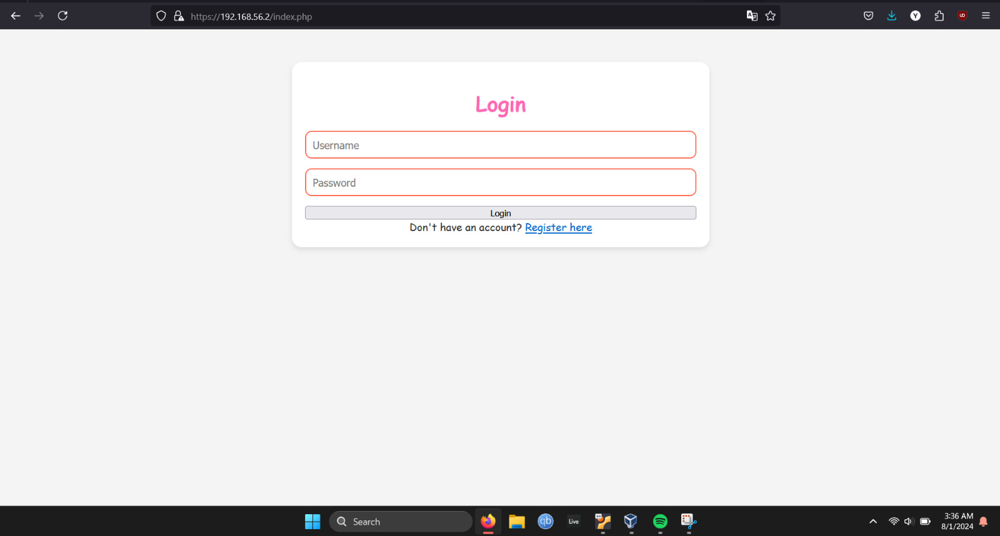

## hashed passwords and no mysql root account for php

This screenshot shows that the database has passwords hashed
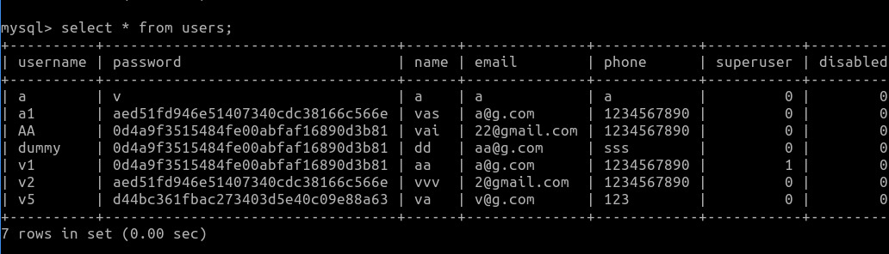

This snippet from database.sql shows how i am using md5 to hash all the passwords when the user registers.
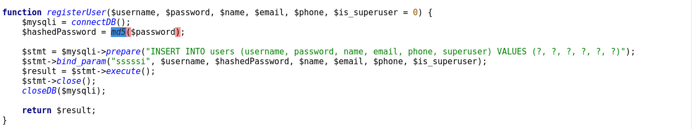

In this snipped you can see that no mysql root account is being used by my php code. it is clearly using my vibudhvh account
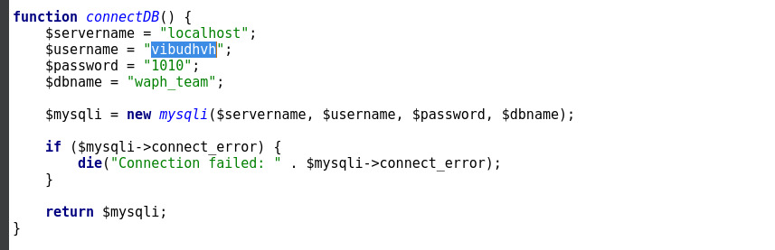

## prepared sql statements

These are just a few examples of me preparing sql statements to make them less susceptible to scripting attacks, sql injections etc.

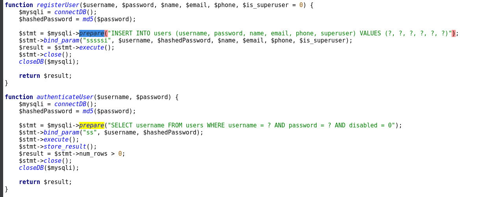

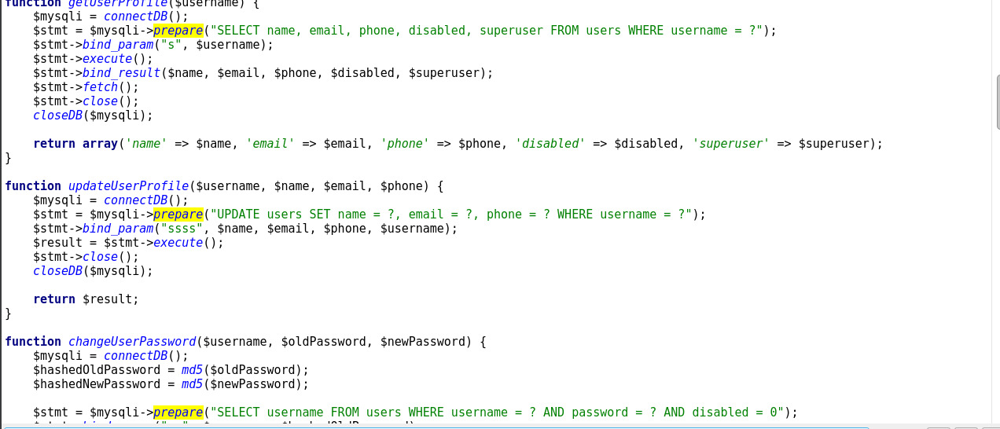

## validated every layer

### html

HTML validation ensures that user inputs meet specific criteria before form submission using attributes like required and pattern.
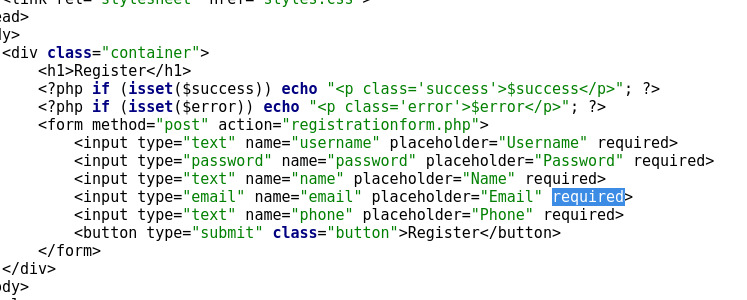

### php

PHP validation provides server-side security by validating and sanitizing inputs to prevent harmful data processing.
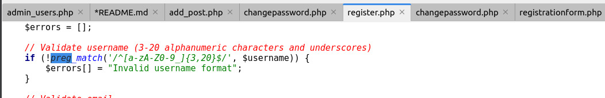
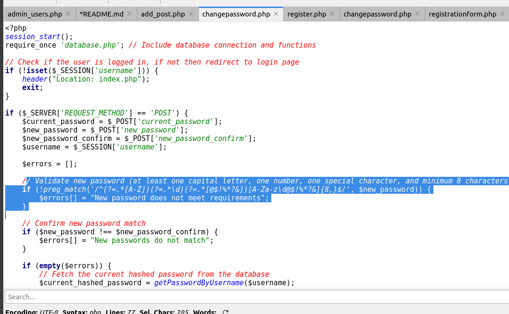

### sql


This layer we are doing validation using prepare.

### HTML outputs must be sanitized

In index I do <?php if (isset($error)) echo "<p class='error'>" . htmlentities($error) . "</p>"; ?>
and in profile.php I do <p>Name: <?php echo htmlentities($user['name']); ?></p>

<p>Email: <?php echo htmlentities($user['email']); ?></p>
<p>Phone: <?php echo htmlentities($user['phone']); ?></p>

This is typically done using functions that escape special HTML characters so they are not interpreted as code by the browser.

## Role-based access control for registered users and super users

### A regular user cannot log in as a superuser


v1 is the only supersuer.

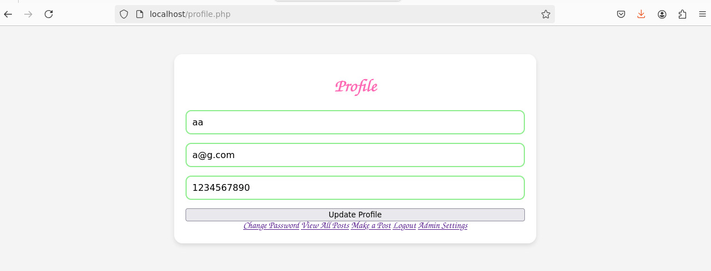
I logged in as v2 which is shown by the name and email as in the previous screenshot and admin setting arent visible here which are visible when i log in as v1 in the screenshot below.
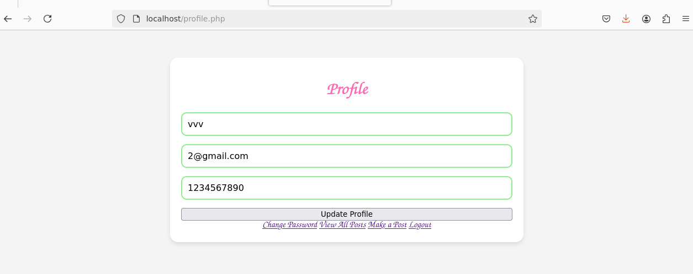

I set the session superuser as true if its a superuser and kick them out of the admin page if they come there without the session. the button doesn't show up on the profile if they arent a superuser.

### A regular user cannot edit/update posts of other users

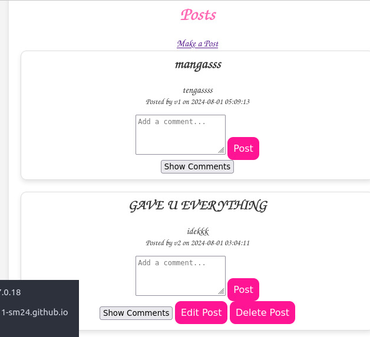

As you can see in the screenshot where I am logged in as v2 i can only edit the post made by v2 and not the one made by v1.

In the backend i search if the post is made by the user and only if it is, then I show the edit button, or else i don't.

### Session Authentication and Hijacking Prevention

Im doing this by
Ensure your site is served over HTTPS to encrypt the data between the client and server.

Regenerate the session ID after login to prevent session fixation attacks.

Set session cookies with the Secure and HttpOnly flags.
Implement a session timeout to log out inactive users.

I also make the pages require session_auth and database.php which does authentication as well.

### CSRF Protection

Session_auth does this for us and I use it on all pages to make sure there is no hijacking happening.

I do it add_comment.php like this:

// Check CSRF token
if (!isset($\_POST['nocsrftoken']) || $\_POST['nocsrftoken'] !== $\_SESSION['nocsrftoken']) {
die("CSRF validation failed.");
}

### Integrating an open-source front-end CSS template


I do this in admin_users as shown in this screenshot. I just pull it from the internet in style.


### Sprint 0

Duration: 30/07/2024-31/07/2024

#### Completed Tasks: 

1. Team Setup
2. Project Planning
3. Repository Setup

#### Contributions: 

1. Vaishakh, 2 commits, 2 hours, contributed in all of the tasks done in the spring

#### Sprint Retrospection:

I had trouble ensuring that the GitHub repository is correctly set up a little but but the rest all went fine.

### Sprint 1

Duration: 30/07/2024-31/07/2024

#### Completed Tasks: 

1. Database Design
2. User Registration and Login
3. Profile Management
4. View posts

#### Contributions: 

1. Vaishakh, 1 commits, 5 hours, contributed in all of the tasks done in the sprint

#### Sprint Retrospection:

I had trouble getting the input validatation working for password changing for some reason.  Designing a robust database schema that meets all requirements was very challenging. I overcame this by Using online resources, tutorials.

### Sprint 2

Duration: 31/07/2024-31/07/2024

#### Completed Tasks: 

1. Post Management
2. Comment Management
4. Post Access Control

#### Contributions: 

1. Vaishakh, 2 commits, 5 hours, contributed in all of the tasks done in the sprint

#### Sprint Retrospection:

I found implementing features for adding, editing, and deleting posts to be challenging, especially ensuring that users can only manage their own posts. I overcame this by going to forums to overcome technical difficulties and enhance your skills.

### Sprint 3

Duration: 31/07/2024-31/07/2024

#### Completed Tasks: 

1. Superuser Functions
2. Real-Time Chat
4. Superuser Access

#### Contributions: 

1. Vaishakh, 2 commits, 5 hours, contributed in all of the tasks done in the sprint

#### Sprint Retrospection:

Implementing features for superusers to disable and enable accounts was complex, particularly in ensuring that disabled users are correctly handled and that their sessions are managed properly.  I overcame this by going to forums to overcome technical difficulties and enhance your skills.

### Appendix

### add_comment.php

```
<?php
session_start();
require 'session_auth.php'; // Include session settings and CSRF token setup
require 'database.php'; // Include database connection and functions

// Check if the user is logged in
if (!isset($_SESSION['username'])) {
    header('Location: index.php');
    exit();
}

// Check CSRF token
if (!isset($_POST['nocsrftoken']) || $_POST['nocsrftoken'] !== $_SESSION['nocsrftoken']) {
    die("CSRF validation failed.");
}

if ($_SERVER['REQUEST_METHOD'] === 'POST' && isset($_POST['post_id']) && isset($_POST['comment'])) {
    $post_id = $_POST['post_id'];
    $comment = $_POST['comment'];
    $username = $_SESSION['username'];

    // Validate comment content (e.g., basic validation)
    if (empty($comment)) {
        die("Comment cannot be empty.");
    }

    // Add the comment to the database
    if (add_comment($post_id, $comment, $username)) {
        echo "Comment added successfully.";
    } else {
        echo "Failed to add comment.";
    }
} else {
    echo "Invalid request.";
}

// Redirect back to the profile or previous page
header('Location: profile.php');
exit();
?>
```

### add_comment.php

```
<?php
session_start();
require_once 'session_auth.php'; // Include session settings and CSRF token setup
require_once 'database.php'; // Include database connection and functions

// Check if the user is logged in, if not then redirect to login page
if (!isset($_SESSION['username'])) {
    header("Location: index.php");
    exit;
}

if ($_SERVER['REQUEST_METHOD'] == 'POST') {
    $username = $_SESSION['username'];
    $title = trim($_POST['title']);
    $content = trim($_POST['content']);

    // Check CSRF token
    if (!isset($_POST['nocsrftoken']) || $_POST['nocsrftoken'] !== $_SESSION['nocsrftoken']) {
        die("CSRF validation failed.");
    }

    // Validate input
    if (!empty($title) && !empty($content)) {
        if (addPost($username, $title, $content)) {
            header("Location: viewposts.php");
            exit;
        } else {
            $error = "Post creation failed.";
        }
    } else {
        $error = "Title and content cannot be empty.";
    }
}
?>

<!DOCTYPE html>
<html lang="en">
<head>
    <meta charset="UTF-8">
    <title>Make a Post</title>
    <link rel="stylesheet" href="styles.css">
</head>
<body>
    <div class="container">
        <h1>Make a Post</h1>
        <?php if (isset($error)) echo "<p class='error'>$error</p>"; ?>
        <form method="post" action="add_post.php">
            <input type="hidden" name="nocsrftoken" value="<?php echo htmlspecialchars($_SESSION['nocsrftoken']); ?>">
            <input type="text" name="title" placeholder="Title" required>
            <textarea name="content" placeholder="Content" required></textarea>
            <button type="submit" class="button">Post</button>
        </form>
        <a href="viewposts.php">View All Posts</a>
    </div>
</body>
</html>

```

### admin_users.php

```
<?php
session_start();
require_once 'session_auth.php'; // Include session settings and CSRF token setup
require_once 'database.php'; // Include database connection and functions

// Check if the user is logged in and is a superuser
if (!isset($_SESSION['username']) || !$_SESSION['superuser']) {
    header("Location: index.php");
    exit;
}

// Retrieve users from the database
$users = getAllUsers();

if ($_SERVER['REQUEST_METHOD'] === 'POST') {
    if (isset($_POST['update_user'])) {
        $username = $_POST['username'];
        $disabled = isset($_POST['disabled']) ? 1 : 0;

        // Check CSRF token
        if (!isset($_POST['nocsrftoken']) || $_POST['nocsrftoken'] !== $_SESSION['nocsrftoken']) {
            die("CSRF validation failed.");
        }

        // Update user status
        updateUserStatus($username, $disabled);
        header("Location: admin_users.php");
        exit;
    }
}
?>

<!DOCTYPE html>
<html lang="en">
<head>
    <meta charset="UTF-8">
    <title>Admin - Manage Users</title>
    <link rel="stylesheet" href="https://stackpath.bootstrapcdn.com/bootstrap/4.5.2/css/bootstrap.min.css">
    <script src="https://code.jquery.com/jquery-3.5.1.slim.min.js"></script>
    <script src="https://cdn.jsdelivr.net/npm/@popperjs/core@2.5.3/dist/umd/popper.min.js"></script>
    <script src="https://stackpath.bootstrapcdn.com/bootstrap/4.5.2/js/bootstrap.min.js"></script>
</head>
<body>
    <div class="container mt-5">
        <h1 class="mb-4">Manage Users</h1>
        <table class="table table-bordered table-striped">
            <thead>
                <tr>
                    <th>Username</th>
                    <th>Status</th>
                    <th>Actions</th>
                </tr>
            </thead>
            <tbody>
                <?php foreach ($users as $user): ?>
                    <tr>
                        <td><?php echo htmlentities($user['username']); ?></td>
                        <td>
                            <?php echo $user['disabled'] ? 'Disabled' : 'Active'; ?>
                        </td>
                        <td>
                            <form action="admin_users.php" method="POST" class="form-inline">
                                <input type="hidden" name="nocsrftoken" value="<?php echo htmlspecialchars($_SESSION['nocsrftoken']); ?>">
                                <input type="hidden" name="username" value="<?php echo htmlspecialchars($user['username']); ?>">
                                <div class="form-check">
                                    <input type="checkbox" name="disabled" class="form-check-input" <?php echo $user['disabled'] ? 'checked' : ''; ?>>
                                    <label class="form-check-label">Disable</label>
                                </div>
                                <input type="submit" name="update_user" value="Update" class="btn btn-primary ml-2">
                            </form>
                        </td>
                    </tr>
                <?php endforeach; ?>
            </tbody>
        </table>
    </div>
</body>
</html>
```

### changepassword.php

```
<?php
session_start();
require_once 'database.php'; // Include database connection and functions

// Check if the user is logged in, if not then redirect to login page
if (!isset($_SESSION['username'])) {
    header("Location: index.php");
    exit;
}

if ($_SERVER['REQUEST_METHOD'] == 'POST') {
    $current_password = $_POST['current_password'];
    $new_password = $_POST['new_password'];
    $new_password_confirm = $_POST['new_password_confirm'];
    $username = $_SESSION['username'];

    $errors = [];

    // Validate new password (at least one capital letter, one number, one special character, and minimum 8 characters)
    if (!preg_match('/^(?=.*[A-Z])(?=.*\d)(?=.*[@$!%*?&])[A-Za-z\d@$!%*?&]{8,}$/', $new_password)) {
        $errors[] = "New password does not meet requirements";
    }

    // Confirm new password match
    if ($new_password !== $new_password_confirm) {
        $errors[] = "New passwords do not match";
    }

    if (empty($errors)) {
        // Fetch the current hashed password from the database
        $current_hashed_password = getPasswordByUsername($username);

        // Verify current password
        if (md5($current_password) === $current_hashed_password) {
            // Hash the new password
            $hashed_new_password = md5($new_password);

            // Update the password in the database
            changePassword($username, $hashed_new_password);

            // Redirect to profile page
            header("Location: profile.php");
            exit;
        } else {
            $errors[] = "Current password is incorrect";
        }
    }
}
?>

<!DOCTYPE html>
<html lang="en">
<head>
    <meta charset="UTF-8">
    <title>Change Password</title>
    <link rel="stylesheet" href="styles.css">
</head>
<body>
    <div class="container">
        <h1>Change Password</h1>
        <?php if (!empty($errors)): ?>
            <div class="errors">
                <?php foreach ($errors as $error): ?>
                    <p><?php echo htmlentities($error); ?></p>
                <?php endforeach; ?>
            </div>
        <?php endif; ?>
        <form method="post" action="changepassword.php">
            <input type="password" name="current_password" placeholder="Current Password" required>
            <input type="password" name="new_password" placeholder="New Password" required>
            <input type="password" name="new_password_confirm" placeholder="Confirm New Password" required>
            <button type="submit" class="button">Change Password</button>
        </form>
    </div>
</body>
</html>
```

### comments.php

```
<?php
session_start();
require 'session_auth.php'; // Include session settings and CSRF token setup
require 'database.php'; // Include database connection and functions

// Check if the user is logged in
if (!isset($_SESSION['username'])) {
    header('Location: index.php');
    exit();
}

// Retrieve posts to display
$posts = get_posts();
?>

<!DOCTYPE html>
<html lang="en">
<head>
    <meta charset="UTF-8">
    <meta name="viewport" content="width=device-width, initial-scale=1.0">
    <title>Comments</title>
    <link rel="stylesheet" href="styles.css"> <!-- Link to your CSS -->
</head>
<body>
    <h1>Post Comments</h1>

    <!-- Display posts -->
    <?php foreach ($posts as $post): ?>
        <div class="post">
            <h2><?php echo htmlspecialchars($post['title']); ?></h2>
            <p><?php echo htmlspecialchars($post['content']); ?></p>

            <!-- Comment form -->
            <form action="add_comment.php" method="post">
                <input type="hidden" name="nocsrftoken" value="<?php echo htmlspecialchars($_SESSION['nocsrftoken']); ?>">
                <input type="hidden" name="post_id" value="<?php echo htmlspecialchars($post['post_id']); ?>">
                <textarea name="comment" rows="4" cols="50" placeholder="Add your comment here..."></textarea>
                <button type="submit">Submit Comment</button>
            </form>

            <!-- Display comments for this post -->
            <?php
            $comments = get_comments($post['post_id']);
            foreach ($comments as $comment):
            ?>
                <div class="comment">
                    <p><?php echo htmlspecialchars($comment['comment']); ?></p>
                    <small>— <?php echo htmlspecialchars($comment['username']); ?></small>
                </div>
            <?php endforeach; ?>
        </div>
    <?php endforeach; ?>
</body>
</html>

```

### database.php

```
<?php

function connectDB() {
    $servername = "localhost";
    $username = "vibudhvh";
    $password = "1010";
    $dbname = "waph_team";

    $mysqli = new mysqli($servername, $username, $password, $dbname);

    if ($mysqli->connect_error) {
        die("Connection failed: " . $mysqli->connect_error);
    }

    return $mysqli;
}

function closeDB($mysqli) {
    $mysqli->close();
}

function registerUser($username, $password, $name, $email, $phone, $is_superuser = 0) {
    $mysqli = connectDB();
    $hashedPassword = md5($password);

    $stmt = $mysqli->prepare("INSERT INTO users (username, password, name, email, phone, superuser) VALUES (?, ?, ?, ?, ?, ?)");
    $stmt->bind_param("sssssi", $username, $hashedPassword, $name, $email, $phone, $is_superuser);
    $result = $stmt->execute();
    $stmt->close();
    closeDB($mysqli);

    return $result;
}

function authenticateUser($username, $password) {
    $mysqli = connectDB();
    $hashedPassword = md5($password);

    $stmt = $mysqli->prepare("SELECT username FROM users WHERE username = ? AND password = ? AND disabled = 0");
    $stmt->bind_param("ss", $username, $hashedPassword);
    $stmt->execute();
    $stmt->store_result();
    $result = $stmt->num_rows > 0;
    $stmt->close();
    closeDB($mysqli);

    return $result;
}

function getUserProfile($username) {
    $mysqli = connectDB();
    $stmt = $mysqli->prepare("SELECT name, email, phone, disabled, superuser FROM users WHERE username = ?");
    $stmt->bind_param("s", $username);
    $stmt->execute();
    $stmt->bind_result($name, $email, $phone, $disabled, $superuser);
    $stmt->fetch();
    $stmt->close();
    closeDB($mysqli);

    return array('name' => $name, 'email' => $email, 'phone' => $phone, 'disabled' => $disabled, 'superuser' => $superuser);
}

function updateUserProfile($username, $name, $email, $phone) {
    $mysqli = connectDB();
    $stmt = $mysqli->prepare("UPDATE users SET name = ?, email = ?, phone = ? WHERE username = ?");
    $stmt->bind_param("ssss", $name, $email, $phone, $username);
    $result = $stmt->execute();
    $stmt->close();
    closeDB($mysqli);

    return $result;
}

function changeUserPassword($username, $oldPassword, $newPassword) {
    $mysqli = connectDB();
    $hashedOldPassword = md5($oldPassword);
    $hashedNewPassword = md5($newPassword);

    $stmt = $mysqli->prepare("SELECT username FROM users WHERE username = ? AND password = ? AND disabled = 0");
    $stmt->bind_param("ss", $username, $hashedOldPassword);
    $stmt->execute();
    $stmt->store_result();

    if ($stmt->num_rows > 0) {
        $stmt->close();
        $stmt = $mysqli->prepare("UPDATE users SET password = ? WHERE username = ?");
        $stmt->bind_param("ss", $hashedNewPassword, $username);
        $result = $stmt->execute();
    } else {
        $result = false;
    }
    $stmt->close();
    closeDB($mysqli);

    return $result;
}

function addPost($username, $title, $content) {
    $mysqli = connectDB();
    $stmt = $mysqli->prepare("INSERT INTO posts (title, content, username) VALUES (?, ?, ?)");
    $stmt->bind_param("sss", $title, $content, $username);
    $result = $stmt->execute();
    $stmt->close();
    closeDB($mysqli);

    return $result;
}

function getAllPosts() {
    $mysqli = connectDB();
    $posts = array();

    $stmt = $mysqli->prepare("SELECT posts.postID, posts.title, posts.content, posts.date, users.username FROM posts JOIN users ON posts.username = users.username ORDER BY posts.date DESC");
    $stmt->execute();
    $stmt->bind_result($postID, $title, $content, $date, $username);

    while ($stmt->fetch()) {
        $posts[] = array('postID' => $postID, 'title' => $title, 'content' => $content, 'date' => $date, 'username' => $username);
    }
    $stmt->close();
    closeDB($mysqli);

    return $posts;
}

function getPostByID($postID) {
    $mysqli = connectDB();
    $stmt = $mysqli->prepare("SELECT postID, title, content, date, username FROM posts WHERE postID = ?");
    $stmt->bind_param("i", $postID);
    $stmt->execute();
    $result = $stmt->get_result();
    $post = $result->fetch_assoc();
    $stmt->close();
    closeDB($mysqli);

    return $post;
}

function updatePost($postID, $title, $content) {
    $mysqli = connectDB();
    $stmt = $mysqli->prepare("UPDATE posts SET title = ?, content = ? WHERE postID = ?");
    $stmt->bind_param("ssi", $title, $content, $postID);
    $result = $stmt->execute();
    $stmt->close();
    closeDB($mysqli);

    return $result;
}

function deletePost($postID, $username) {
    $mysqli = connectDB();

    // Check if the post belongs to the user
    $stmt = $mysqli->prepare("SELECT username FROM posts WHERE postID = ?");
    $stmt->bind_param("i", $postID);
    $stmt->execute();
    $stmt->bind_result($postOwner);
    $stmt->fetch();
    $stmt->close();

    if ($postOwner === $username) {
        // Delete associated comments first
        $stmt = $mysqli->prepare("DELETE FROM comments WHERE postID = ?");
        $stmt->bind_param("i", $postID);
        $stmt->execute();
        $stmt->close();

        // Delete the post
        $stmt = $mysqli->prepare("DELETE FROM posts WHERE postID = ?");
        $stmt->bind_param("i", $postID);
        $stmt->execute();
        $stmt->close();

        closeDB($mysqli);
        return true;
    }

    closeDB($mysqli);
    return false;
}

function addComment($postID, $content, $username) {
    $mysqli = connectDB();
    $stmt = $mysqli->prepare("INSERT INTO comments (postID, content, username) VALUES (?, ?, ?)");
    $stmt->bind_param("iss", $postID, $content, $username);
    $result = $stmt->execute();
    $stmt->close();
    closeDB($mysqli);

    return $result;
}

function getCommentsByPostID($postID) {
    $mysqli = connectDB();
    $stmt = $mysqli->prepare("SELECT content, username, date FROM comments WHERE postID = ? ORDER BY date DESC");
    $stmt->bind_param("i", $postID);
    $stmt->execute();
    $result = $stmt->get_result();
    $comments = $result->fetch_all(MYSQLI_ASSOC);
    $stmt->close();
    closeDB($mysqli);

    return $comments;
}

function postExists($postID) {
    $mysqli = connectDB();
    $stmt = $mysqli->prepare("SELECT 1 FROM posts WHERE postID = ?");
    $stmt->bind_param("i", $postID);
    $stmt->execute();
    $stmt->store_result();
    $exists = $stmt->num_rows > 0;
    $stmt->close();
    closeDB($mysqli);

    return $exists;
}

function getUserByEmail($email) {
    $mysqli = connectDB();
    $stmt = $mysqli->prepare("SELECT username FROM users WHERE email = ?");
    $stmt->bind_param("s", $email);
    $stmt->execute();
    $result = $stmt->get_result();
    $user = $result->fetch_assoc();
    $stmt->close();
    closeDB($mysqli);

    return $user;
}


?>
```

### edit_post.php

```
<?php
session_start();
require_once 'database.php';

if (!isset($_SESSION['username'])) {
    header("Location: index.php");
    exit;
}

$postID = $_GET['postID'] ?? null;
if ($postID === null) {
    header("Location: viewposts.php");
    exit;
}

$post = getPostByID($postID); // Function to get post details

if (!$post) {
    header("Location: viewposts.php");
    exit;
}

// Check if the logged-in user is the owner of the post
if ($_SESSION['username'] !== $post['username']) {
    header("Location: viewposts.php");
    exit;
}

if ($_SERVER['REQUEST_METHOD'] == 'POST') {
    $title = $_POST['title'];
    $content = $_POST['content'];

    if (updatePost($postID, $title, $content)) {
        $success = "Post updated successfully!";
        $post = getPostByID($postID); // Refresh post details
    } else {
        $error = "Failed to update post.";
    }
}
?>

<!DOCTYPE html>
<html lang="en">
<head>
    <meta charset="UTF-8">
    <title>Edit Post</title>
    <link rel="stylesheet" href="styles.css">
</head>
<body>
    <div class="container">
        <h1>Edit Post</h1>
        <?php if (isset($success)) echo "<p class='success'>$success</p>"; ?>
        <?php if (isset($error)) echo "<p class='error'>$error</p>"; ?>
        <form method="post" action="edit_post.php?postID=<?php echo htmlspecialchars($postID); ?>">
            <input type="text" name="title" value="<?php echo htmlspecialchars($post['title']); ?>" required>
            <textarea name="content" required><?php echo htmlspecialchars($post['content']); ?></textarea>
            <button type="submit" class="button">Update Post</button>
        </form>
        <a href="viewposts.php">Back to Posts</a>
    </div>
</body>
</html>

```

### index.php

```
<?php
session_start();
require_once 'database.php';
require 'session_auth.php'; // Include session settings and CSRF token setup


if ($_SERVER['REQUEST_METHOD'] == 'POST') {
    $username = $_POST['username'];
    $password = $_POST['password'];

    if (authenticateUser($username, $password)) {
        $mysqli = connectDB();
        $stmt = $mysqli->prepare("SELECT superuser, disabled FROM users WHERE username = ?");
        $stmt->bind_param("s", $username);
        $stmt->execute();
        $stmt->bind_result($superuser, $disabled);
        $stmt->fetch();
        $stmt->close();
        closeDB($mysqli);

        // Debugging output
        echo "Username: $username<br>";
        echo "Disabled: $disabled<br>";

        if ($disabled) {
            $error = "Your account is disabled.";
        } else {
            $_SESSION['username'] = $username;
            $_SESSION['superuser'] = $superuser;
            header("Location: profile.php");
            exit;
        }
    } else {
        $error = "Invalid username or password";
    }
}
?>

<!DOCTYPE html>
<html lang="en">
<head>
    <meta charset="UTF-8">
    <title>Login</title>
    <link rel="stylesheet" href="styles.css">
</head>
<body>
    <div class="container">
        <h1>Login</h1>
        <?php if (isset($error)) echo "<p class='error'>$error</p>"; ?>
        <form method="post" action="index.php">
            <input type="text" name="username" placeholder="Username" required>
            <input type="password" name="password" placeholder="Password" required>
            <button type="submit" class="button">Login</button>
        </form>
        <p>Don't have an account? <a href="registrationform.php">Register here</a></p>
    </div>
</body>
</html>

```

### logout.php

```
<?php
session_start();
session_unset();
session_destroy();
header("Location: index.php");
?>
```

### profile.php

```
<?php
session_start();
require_once 'database.php';
require 'session_auth.php'; // Include session settings and CSRF token setup


// Check if the user is logged in, if not then redirect to login page
if (!isset($_SESSION['username'])) {
    header("Location: index.php");
    exit;
}

$username = $_SESSION['username'];
$userProfile = getUserProfile($username);

// Check if the user is disabled
if ($userProfile['disabled']) {
    die('Your account has been disabled.');
}

// Check if the user is a superuser
$is_superuser = $userProfile['superuser'] == 1;

if ($_SERVER['REQUEST_METHOD'] == 'POST') {
    $name = $_POST['name'];
    $email = $_POST['email'];
    $phone = $_POST['phone'];

    if (updateUserProfile($username, $name, $email, $phone)) {
        $success = "Profile updated successfully!";
        $userProfile = getUserProfile($username);
    } else {
        $error = "Profile update failed.";
    }
}
?>

<!DOCTYPE html>
<html lang="en">
<head>
    <meta charset="UTF-8">
    <title>Profile</title>
    <link rel="stylesheet" href="styles.css">
</head>
<body>
    <div class="container">
        <h1>Profile</h1>
        <?php if (isset($success)) echo "<p class='success'>$success</p>"; ?>
        <?php if (isset($error)) echo "<p class='error'>$error</p>"; ?>
        <form method="post" action="profile.php">
            <input type="text" name="name" value="<?php echo htmlentities($userProfile['name']); ?>" required>
            <input type="email" name="email" value="<?php echo htmlentities($userProfile['email']); ?>" required>
            <input type="text" name="phone" value="<?php echo htmlentities($userProfile['phone']); ?>" required>
            <button type="submit" class="button">Update Profile</button>
        </form>
        <a href="changepassword.php">Change Password</a>
        <a href="viewposts.php">View All Posts</a>
        <a href="add_post.php">Make a Post</a>
        <a href="logout.php">Logout</a>

        <?php if ($is_superuser): ?>
            <a href="admin_users.php" class="admin-button">Admin Settings</a>
        <?php endif; ?>
    </div>
</body>
</html>

```

### register.php

```
<?php
session_start();
require_once 'database.php'; // Include database connection and functions

if ($_SERVER['REQUEST_METHOD'] == 'POST') {
    $username = trim($_POST['username']);
    $email = trim($_POST['email']);
    $password = $_POST['password'];
    $password_confirm = $_POST['password_confirm'];
    $phone = trim($_POST['phone']);

    $errors = [];

    // Validate username (3-20 alphanumeric characters and underscores)
    if (!preg_match('/^[a-zA-Z0-9_]{3,20}$/', $username)) {
        $errors[] = "Invalid username format";
    }

    // Validate email
    if (!filter_var($email, FILTER_VALIDATE_EMAIL)) {
        $errors[] = "Invalid email format";
    }

    // Validate password (at least one capital letter, one number, one special character, and minimum 8 characters)
    if (!preg_match('/^(?=.*[A-Z])(?=.*\d)(?=.*[@$!%*?&])[A-Za-z\d@$!%*?&]{8,}$/', $password)) {
        $errors[] = "Password does not meet requirements";
    }

    // Confirm password match
    if ($password !== $password_confirm) {
        $errors[] = "Passwords do not match";
    }

    // Validate phone number (example: 10 digits)
    if (!preg_match('/^\d{10}$/', $phone)) {
        $errors[] = "Invalid phone number format";
    }

    // Check for existing username
    if (usernameExists($username)) {
        $errors[] = "Username already exists";
    }

    if (empty($errors)) {
        // Hash the password
        $hashed_password = md5($password); // Use MD5 as per your requirement

        // Register the user
        registerUser($username, $email, $hashed_password, $phone);

        // Redirect to login page
        header("Location: index.php");
        exit;
    }
}
?>

<!DOCTYPE html>
<html lang="en">
<head>
    <meta charset="UTF-8">
    <title>Register</title>
    <link rel="stylesheet" href="styles.css">
</head>
<body>
    <div class="container">
        <h1>Register</h1>
        <?php if (!empty($errors)): ?>
            <div class="errors">
                <?php foreach ($errors as $error): ?>
                    <p><?php echo htmlentities($error); ?></p>
                <?php endforeach; ?>
            </div>
        <?php endif; ?>
        <form method="post" action="register.php">
            <input type="text" name="username" placeholder="Username" required>
            <input type="email" name="email" placeholder="Email" required>
            <input type="password" name="password" placeholder="Password" required>
            <input type="password" name="password_confirm" placeholder="Confirm Password" required>
            <input type="text" name="phone" placeholder="Phone Number" required>
            <button type="submit" class="button">Register</button>
        </form>
        <p>Already have an account? <a href="index.php">Login here</a></p>
    </div>
</body>
</html>

```

###

```
<?php
require_once 'database.php';
require 'session_auth.php';


if ($_SERVER['REQUEST_METHOD'] == 'POST') {
    $username = $_POST['username'];
    $password = $_POST['password'];
    $name = $_POST['name'];
    $email = $_POST['email'];
    $phone = $_POST['phone'];

    if (registerUser($username, $password, $name, $email, $phone)) {
        $success = "Registration successful! You can now <a href='index.php'>login</a>";
    } else {
        $error = "Registration failed.";
    }
}
?>

<!DOCTYPE html>
<html lang="en">
<head>
    <meta charset="UTF-8">
    <title>Register</title>
    <link rel="stylesheet" href="styles.css">
</head>
<body>
    <div class="container">
        <h1>Register</h1>
        <?php if (isset($success)) echo "<p class='success'>$success</p>"; ?>
        <?php if (isset($error)) echo "<p class='error'>$error</p>"; ?>
        <form method="post" action="registrationform.php">
            <input type="text" name="username" placeholder="Username" required>
            <input type="password" name="password" placeholder="Password" required>
            <input type="text" name="name" placeholder="Name" required>
            <input type="email" name="email" placeholder="Email" required>
            <input type="text" name="phone" placeholder="Phone" required>
            <button type="submit" class="button">Register</button>
        </form>
    </div>
</body>
</html>

```

### session_auth.php

```
<?php
session_start();

// Session settings
$lifetime = 15 * 60;
$path = "/";
$domain = ""; // Use an empty string for localhost
$secure = FALSE; // Change to TRUE for HTTPS
$httponly = TRUE;

session_set_cookie_params($lifetime, $path, $domain, $secure, $httponly);

// CSRF token generation
if (!isset($_SESSION['nocsrftoken'])) {
    $_SESSION['nocsrftoken'] = bin2hex(random_bytes(16));
}
?>

```

### styles.css

```
/* Basic reset */
* {
    margin: 0;
    padding: 0;
    box-sizing: border-box;
}

body {
    background-color: #ffe6f2;
    font-family: 'Comic Sans MS', cursive, sans-serif;
    color: #333;
}

.container {
    width: 90%;
    max-width: 600px;
    margin: 50px auto;
    padding: 20px;
    background: #ffccff;
    border-radius: 25px;
    box-shadow: 0 0 20px rgba(0, 0, 0, 0.1);
    text-align: center;
    border: 5px dotted #ff99cc;
}

h1 {
    color: #ff66cc;
    margin-bottom: 20px;
    font-size: 3em;
    text-shadow: 2px 2px #ff99cc;
}

form {
    display: flex;
    flex-direction: column;
    align-items: center;
}

input, textarea, button {
    margin: 10px 0;
    padding: 15px;
    width: 90%;
    max-width: 400px;
    border-radius: 25px;
    border: 2px solid #ff99cc;
    font-size: 1em;
    background-color: #ffffff;
}

textarea {
    height: 120px;
}

button {
    background-color: #ff66cc;
    color: white;
    border: none;
    cursor: pointer;
    transition: background-color 0.3s ease, transform 0.3s ease;
    font-size: 1.2em;
}

button:hover {
    background-color: #ff99cc;
    transform: scale(1.1);
}

.error, .success {
    margin: 10px 0;
    padding: 15px;
    border-radius: 25px;
    width: 90%;
    max-width: 400px;
    font-size: 1.2em;
    border: 2px solid #ff99cc;
}

.error {
    background-color: #f8d7da;
    color: #721c24;
}

.success {
    background-color: #d4edda;
    color: #155724;
}

.post {
    background: #fff;
    border: 3px solid #ff99cc;
    border-radius: 25px;
    padding: 20px;
    margin: 20px 0;
    box-shadow: 0 0 10px rgba(0, 0, 0, 0.1);
    text-align: left;
}

.post h2 {
    color: #ff66cc;
    font-size: 1.8em;
    margin-bottom: 10px;
    text-shadow: 1px 1px #ff99cc;
}

.post p {
    font-size: 1.2em;
    margin-bottom: 10px;
    color: #555;
}

footer {
    margin-top: 30px;
    font-size: 1.2em;
    color: #ff66cc;
    text-shadow: 1px 1px #ff99cc;
}

/* Additional whimsical styles */

button {
    background-color: #ff66cc;
    color: white;
    border: none;
    cursor: pointer;
    transition: background-color 0.3s ease, transform 0.3s ease;
    font-size: 1.2em;
}

button:hover {
    background-color: #ff99cc;
    transform: scale(1.1);
}

.post {
    background: #fff;
    border: 3px solid #ff99cc;
    border-radius: 25px;
    padding: 20px;
    margin: 20px 0;
    box-shadow: 0 0 10px rgba(0, 0, 0, 0.1);
    text-align: left;
}

.comment {
    background: #ffe6f2;
    border: 1px solid #ff99cc;
    border-radius: 15px;
    padding: 10px;
    margin: 10px 0;
}
.post {
    background-color: #fff;
    border: 2px solid #ff1493; /* Deep Pink border */
    border-radius: 10px;
    padding: 20px;
    margin-bottom: 20px;
    box-shadow: 0 4px 8px rgba(0, 0, 0, 0.1);
}

.post h2 {
    margin-top: 0;
}

.comments {
    background-color: #f9f9f9;
    border: 1px solid #ddd;
    border-radius: 10px;
    padding: 10px;
    margin-top: 10px;
}

.comment {
    padding: 10px;
    border-bottom: 1px solid #eee;
}

.comment:last-child {
    border-bottom: none;
}

.comment-form {
    margin-top: 10px;
}


```

### viewposts.php

```
<?php
session_start();
require_once 'session_auth.php'; // Include session settings and CSRF token setup
require_once 'database.php'; // Include database connection and functions

// Check if the user is logged in, if not then redirect to login page
if (!isset($_SESSION['username'])) {
    header("Location: index.php");
    exit;
}

// Retrieve posts to display
$posts = getAllPosts();

if ($_SERVER['REQUEST_METHOD'] === 'POST') {
    if (isset($_POST['comment'])) {
        $postID = intval($_POST['postID']);
        $comment = trim($_POST['comment']);
        $username = $_SESSION['username'];

        // Check CSRF token
        if (!isset($_POST['nocsrftoken']) || $_POST['nocsrftoken'] !== $_SESSION['nocsrftoken']) {
            die("CSRF validation failed.");
        }

        // Validate comment content
        if (!empty($comment)) {
            addComment($postID, $comment, $username);
        }
        header("Location: viewposts.php");
        exit;
    } elseif (isset($_POST['delete_post'])) {
        $postID = intval($_POST['postID']);
        $username = $_SESSION['username'];

        // Check CSRF token
        if (!isset($_POST['nocsrftoken']) || $_POST['nocsrftoken'] !== $_SESSION['nocsrftoken']) {
            die("CSRF validation failed.");
        }

        deletePost($postID, $username);
        header("Location: viewposts.php");
        exit;
    }
}
?>

<!DOCTYPE html>
<html lang="en">
<head>
    <meta charset="UTF-8">
    <title>View Posts</title>
    <link rel="stylesheet" href="styles.css">
    <script>
        function toggleComments(postID) {
            var commentsSection = document.getElementById('comments-' + postID);
            var button = document.getElementById('toggle-button-' + postID);
            if (commentsSection.style.display === 'none' || commentsSection.style.display === '') {
                commentsSection.style.display = 'block';
                button.textContent = 'Hide Comments';
            } else {
                commentsSection.style.display = 'none';
                button.textContent = 'Show Comments';
            }
        }
    </script>
</head>
<body>
    <div class="container">
        <h1>Posts</h1>
        <a href="add_post.php">Make a Post</a>
        <?php foreach ($posts as $post): ?>
            <div class='post' style="border: 1px solid #ddd; padding: 10px; margin-bottom: 20px;">
                <h2><?php echo htmlentities($post['title']); ?></h2>
                <p><?php echo htmlentities($post['content']); ?></p>
                <p><small>Posted by <?php echo htmlentities($post['username']); ?> on <?php echo htmlentities($post['date']); ?></small></p>

                <!-- Comment Form -->
                <div class="comment-form">
                    <form action="viewposts.php" method="POST">
                        <input type="hidden" name="nocsrftoken" value="<?php echo htmlspecialchars($_SESSION['nocsrftoken']); ?>">
                        <input type="hidden" name="postID" value="<?php echo htmlspecialchars($post['postID']); ?>">
                        <div class="comment-input-container">
                            <textarea name="comment" rows="4" placeholder="Add a comment..."></textarea>
                            <input type="submit" value="Post" class="post-button">
                        </div>
                    </form>
                </div>

                <!-- Toggle Comments Button -->
                <button id="toggle-button-<?php echo $post['postID']; ?>" onclick="toggleComments(<?php echo $post['postID']; ?>)">Show Comments</button>

                <!-- Display Comments -->
                <div class="comments" id="comments-<?php echo $post['postID']; ?>" style="display: none;">
                    <?php
                    $comments = getCommentsByPostID($post['postID']);
                    foreach ($comments as $comment):
                    ?>
                        <div class="comment">
                            <p><strong><?php echo htmlentities($comment['username']); ?>:</strong> <?php echo htmlentities($comment['content']); ?></p>
                            <p><small>Posted on <?php echo htmlentities($comment['date']); ?></small></p>
                        </div>
                    <?php endforeach; ?>
                </div>

                <!-- Edit and Delete Post Buttons -->
                <?php if ($post['username'] === $_SESSION['username']): ?>
                    <form action="edit_post.php" method="GET" style="display: inline;">
                        <input type="hidden" name="postID" value="<?php echo htmlspecialchars($post['postID']); ?>">
                        <input type="submit" value="Edit Post" class="edit-button">
                    </form>

                    <form action="viewposts.php" method="POST" style="margin-top: 10px; display: inline;">
                        <input type="hidden" name="nocsrftoken" value="<?php echo htmlspecialchars($_SESSION['nocsrftoken']); ?>">
                        <input type="hidden" name="postID" value="<?php echo htmlspecialchars($post['postID']); ?>">
                        <input type="submit" name="delete_post" value="Delete Post" class="delete-button">
                    </form>
                <?php endif; ?>
            </div>
        <?php endforeach; ?>
    </div>
</body>
</html>


```
